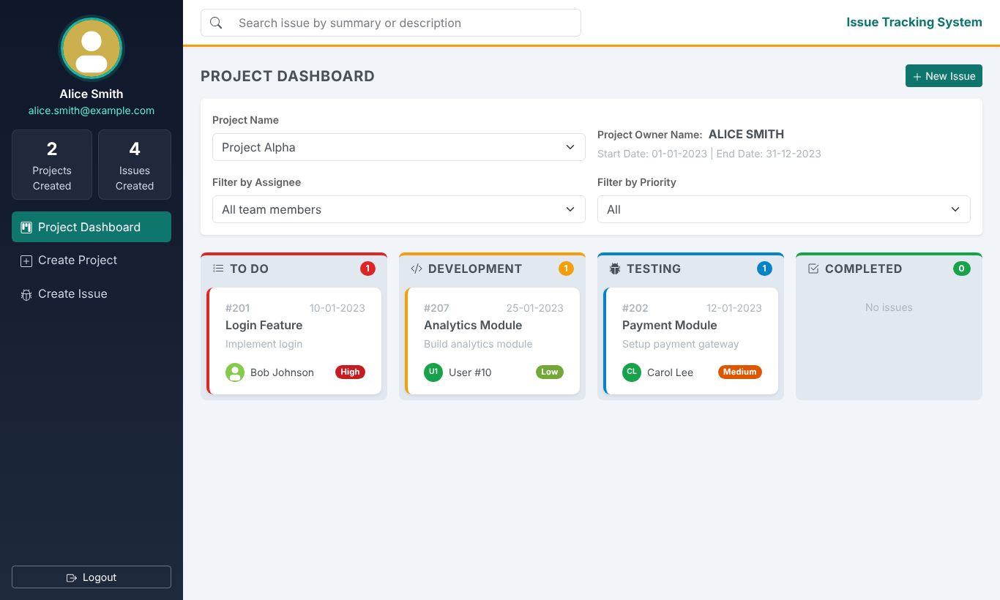
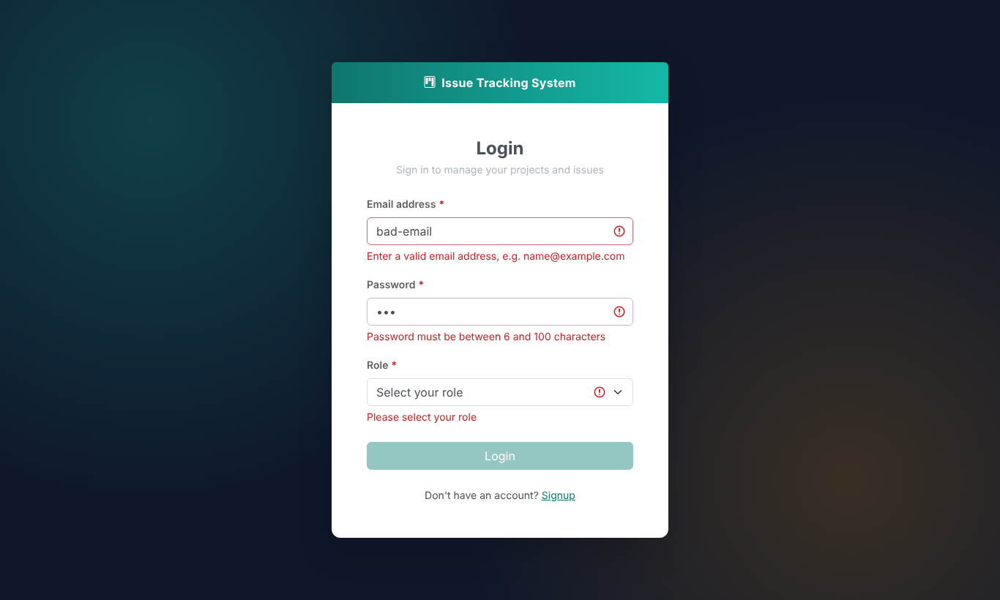
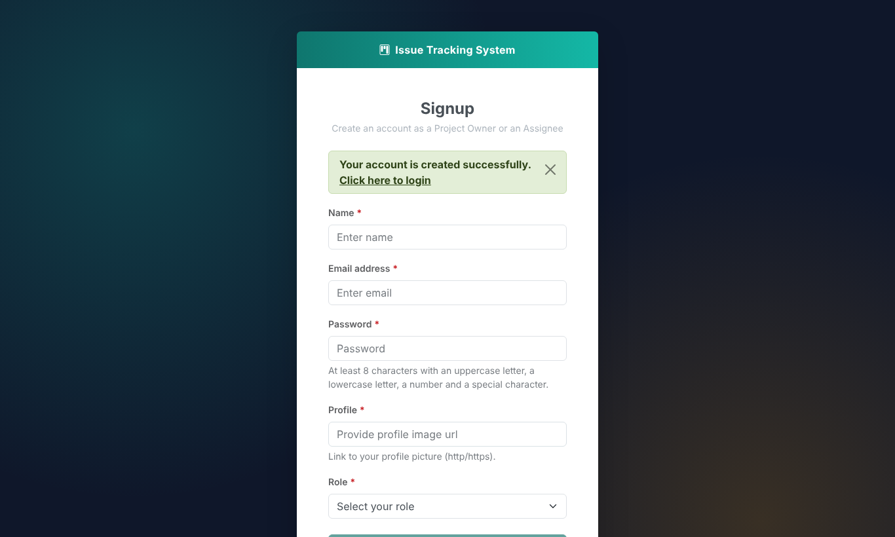
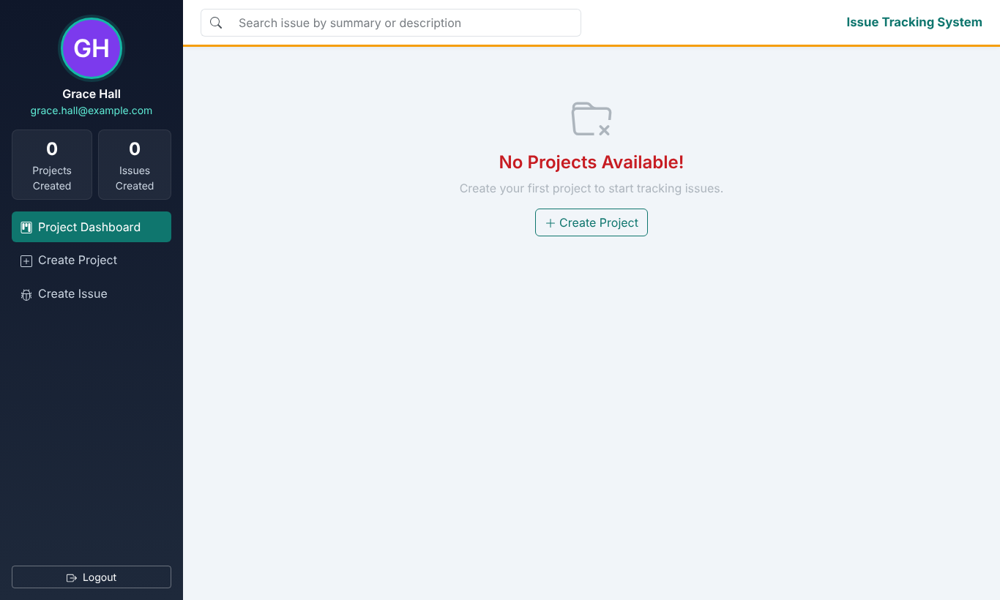
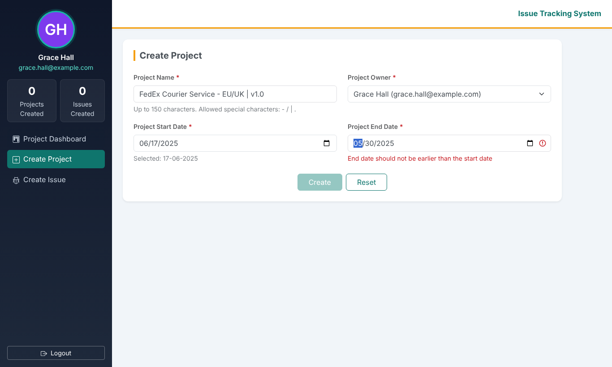
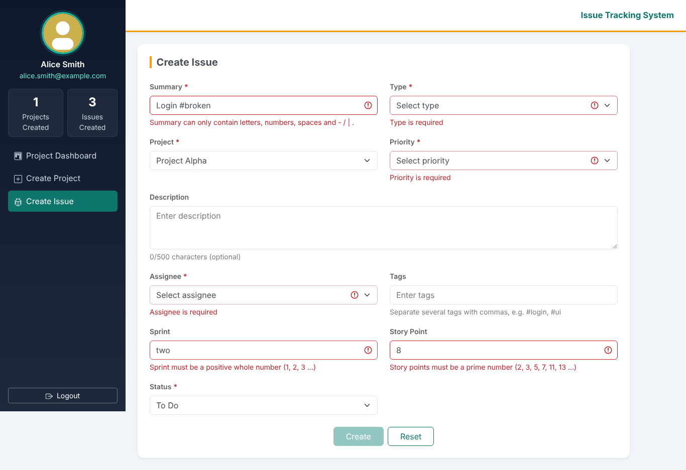
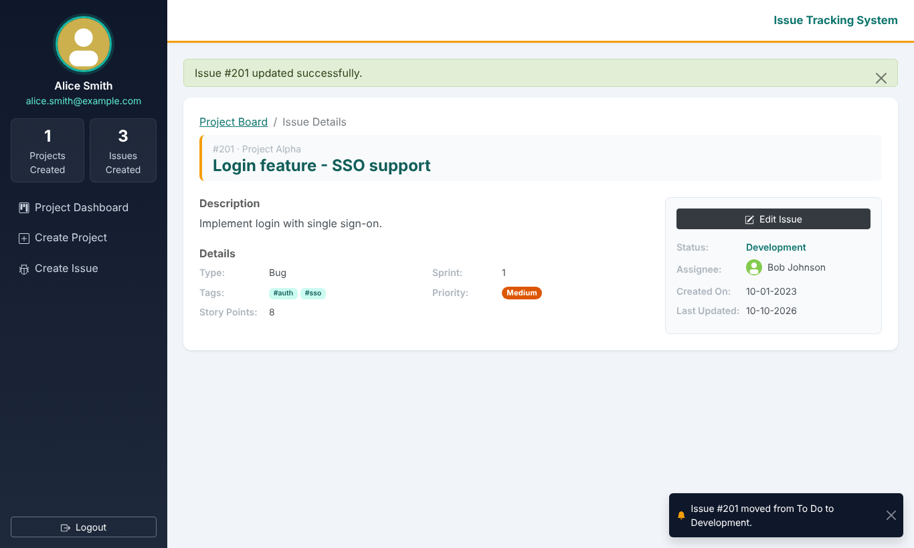
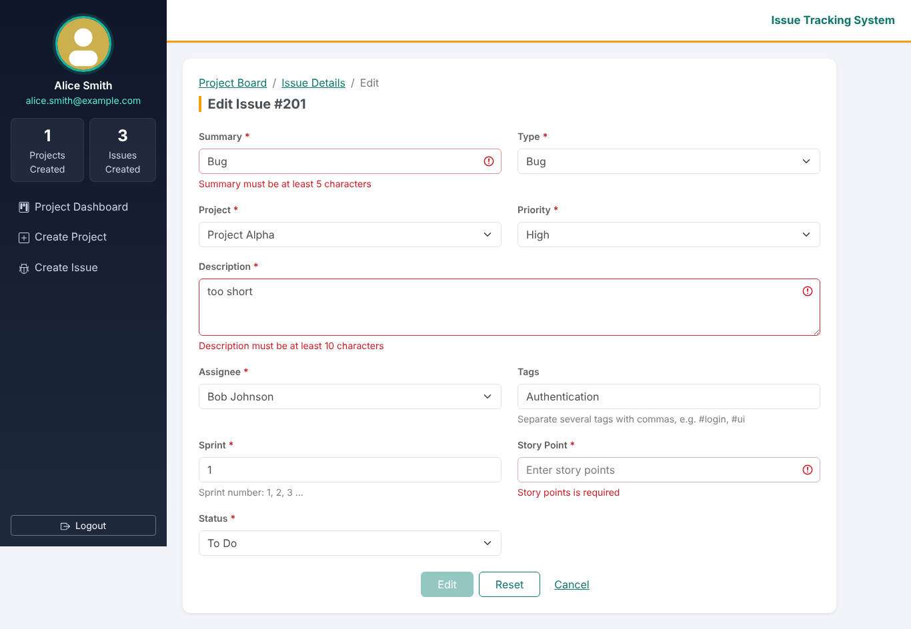
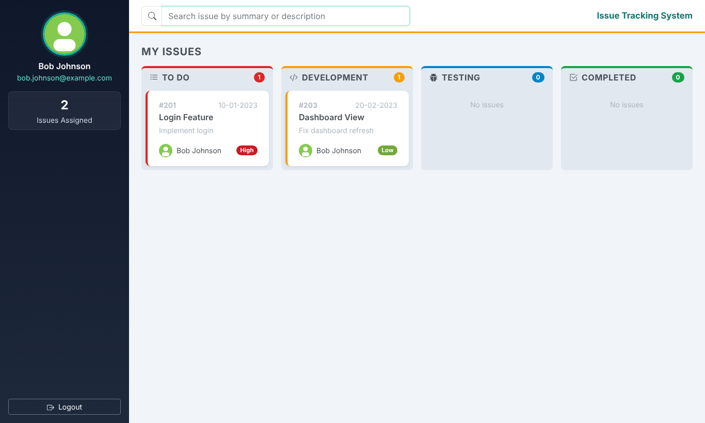

# ITS Front End (React + Bootstrap)

React + TypeScript + Bootstrap 5 user interface for the Issue Tracking System (Week 4 case study).
It talks to the Spring Boot microservices from the Week 2 case study **only through the API Gateway** (`http://localhost:8080`).



## Run it

1. Start the back end (see the root [README](../README.md)): MySQL → `eureka-server` → `user-service`, `project-service`, `issue-service` → `api-gateway`.
2. Install [Node.js 20+](https://nodejs.org/), then in this folder:

   ```bash
   npm install
   npm run dev
   ```

3. Open **http://localhost:3000** and log in, e.g. with the sample data:

   | Role | Email | Password |
   |---|---|---|
   | Project Owner | `alice.smith@example.com` | `abc123` |
   | Assignee | `bob.johnson@example.com` | `def456` |

The Vite dev server forwards every `/api/**` call to the gateway, so no CORS setup is needed.
To use a different gateway URL, copy `.env.example` to `.env.local` and change `VITE_GATEWAY_URL`.

## Scripts

| Command | What it does |
|---|---|
| `npm run dev` | Development server on port 3000 with hot reload |
| `npm run build` | Type-check (`tsc -b`) and build the production bundle into `dist/` |
| `npm run preview` | Serve the built bundle (also proxies `/api` to the gateway) |
| `npm test` | Unit tests (Vitest): validators, form rules, search/date/tag helpers, issue events |
| `npm run lint` | ESLint (`no-explicit-any` is an error) |

## Tech stack

React 19 · TypeScript (strict, no `any`) · Bootstrap 5.3 · React Router 6 · react-icons · Vite 7 · Vitest

## Milestones

| # | Screen | Status |
|---|---|---|
| 1 | Login (React **controlled** form) and Signup (React **uncontrolled** form) | ✅ |
| 2 | Project Owner Dashboard: project drop-down, owner and dates, issue board, assignee/priority filters, RegEx search, "No Projects Available" screen | ✅ |
| 3 | Create Project: validated form, owner drop-down from the Users API, date range check, redirect to the new project's dashboard | ✅ |
| 4 | Create Issue: all field validations (prime story points, numeric sprint, length limits), project and assignee drop-downs, redirect to the project board | ✅ |
| 5 | Issue Details (Project Owner) and Edit Issue: pre-filled form with the edit validations, Reset to the loaded values | ✅ |
| 6 | Assignee Dashboard and Assignee Issue Details: own issues as cards, RegEx search, status drop-down with "Save Updates" | ✅ |
| 7 | Back-end API integration: typed models and services for every screen, error handling, session re-check, issue-event hub with status-change notifications — see [docs/API_INTEGRATION.md](docs/API_INTEGRATION.md) | ✅ |
| 8 | Build pushed to the GitHub repository | ✅ |

## Screens

| Route | Screen | Who |
|---|---|---|
| `/login` | Login | everyone |
| `/signup` | Signup | everyone |
| `/owner/dashboard` | Project Owner Dashboard (`?projectId=` selects a project) | Project Owner |
| `/owner/projects/new` | Create Project | Project Owner |
| `/owner/issues/new` | Create Issue | Project Owner |
| `/owner/issues/:id` | Issue Details | Project Owner |
| `/owner/issues/:id/edit` | Edit Issue | Project Owner |
| `/assignee/dashboard` | Assignee Dashboard | Assignee |
| `/assignee/issues/:id` | Assignee Issue Details (status update) | Assignee |

Routes are guarded by role: logged-out visitors go to `/login`, and each role is kept in its own area.

## Project structure

```
its-frontend/
├── docs/                    API integration notes and screenshots
├── public/                  static files (favicon)
├── src/
│   ├── components/
│   │   ├── board/           IssueBoard, IssueCard (status columns)
│   │   ├── common/          Avatar, AlertMessage, FormGroup, PriorityBadge, ProtectedRoute, Spinner, TagList, NotificationToasts
│   │   ├── issue/           shared issue form fields + rules, IssueDetailsView
│   │   └── layout/          AppLayout, Sidebar, Header, AuthLayout
│   ├── context/             authentication context (session in sessionStorage)
│   ├── hooks/               useAuth, useApi, useForm, useUsers, useIssueWithProject
│   ├── models/              TypeScript types matching the back-end DTOs
│   ├── pages/               auth/, owner/, assignee/ screens
│   ├── routes/              route paths and navigation state
│   ├── services/            HTTP client, endpoints, user/project/issue services, issue events
│   ├── styles/              theme on top of Bootstrap
│   └── utils/               validators, dates, search, tags, form classes
├── vite.config.ts           dev/preview server on port 3000 with /api proxy
└── package.json
```

## Forms

| Form | React technique | Notes |
|---|---|---|
| Login | **Controlled** (`useState`, `value` + `onChange`) | used instead of a template-driven form, as requested |
| Signup | **Uncontrolled** (the DOM keeps the values; read with a form ref + `FormData`) | used instead of a reactive form, as requested |
| Create Project, Create Issue, Edit Issue | Controlled, through the reusable `useForm` hook | live validation, buttons enabled only when valid |

Validation messages appear once a field has been touched. Submit buttons are disabled while the form is invalid and while the request is running; server errors are shown above the form.

## Validation rules

| Screen | Field | Rule |
|---|---|---|
| Login | Email | required, `name@domain.tld` |
| | Password | required, 6–100 characters, no spaces (6 is the back end's minimum) |
| | Role | required, and must match the account's role |
| Signup | Name | required, not blank, 2–50 letters (plus `. ' -`) |
| | Email | required, valid format |
| | Password | 8–100 characters with upper case, lower case, digit and special character |
| | Profile | required http(s) URL that has an image extension or actually loads as an image |
| | Role | required |
| Create Project | Project Name | required, max 150, only `- / \| .` as special characters |
| | Project Owner | required (drop-down from the Users API) |
| | Start / End Date | required, end date not earlier than start date |
| Create Issue | Summary | required, max 150, only `- / \| .` as special characters |
| | Type, Project, Priority, Assignee, Status | required drop-downs |
| | Description | optional, max 500 |
| | Tags | max 100 |
| | Story Point | prime numbers only |
| | Sprint | positive whole number |
| Edit Issue | Summary | required, 5–100 |
| | Description | required, 10–500 |
| | Sprint, Story Point | required positive whole numbers |
| | Project, Type, Priority, Assignee, Status | required |

## Assumptions

- **API paths:** the requirements list `/api/v1/...`; the Week 2 back end serves the same resources at `/api/...`, which is what the UI calls.
- **Login role:** the back end authenticates with email + password only; the UI also asks for the role (as in the wireframe) and rejects the login if it does not match the account.
- **Issue type:** the mapping table says 1 = BUG, 2 = TASK, 3 = STORY, the edit table says TASK/BUG/FEATURE and the back end supports BUG/TASK/FEATURE. The third option is shown as *Story / Feature* and sent as `FEATURE`.
- **Description on Create Issue** is optional (requirements) but required by the back end, so an empty one is saved as *"No description provided."*.
- **Story points** must be prime on Create Issue and a positive whole number on Edit Issue, exactly as the two tables say.
- **Sprint** is stored as text by the back end; the UI sends a number (`"2"`) and pre-fills older values such as `"Sprint 3"` as `3` when editing.
- **Assignee drop-down** lists every user (assignees first, then project owners), because the sample data also assigns issues to project owners.
- **Project Owner drop-down** on Create Project lists users with the Project Owner role, with the logged-in owner preselected.
- **Issues Created** in the owner's sidebar counts the issues of all projects the owner owns (`GET /api/issues/owner/{ownerId}`).
- **Filter by assignee** lists the team members of the selected project (everyone assigned to one of its issues).
- **Editing:** a Project Owner can edit only issues of their own projects; an Assignee can change only the status, and only of issues assigned to them.
- **Authentication:** the back end issues no token, so the logged-in user is kept in `sessionStorage` (cleared when the tab closes) and re-checked with the back end when the page reloads. Passwords are never stored in the browser.
- **Look and feel:** colours and layout differ slightly from the wireframes (slate sidebar, teal primary colour, amber accents) while keeping every component and function.

## Screenshots

Captured with the sample data from `db/`.

| | |
|---|---|
|  Login with validation |  Signup success |
|  No projects |  Create Project |
|  Create Issue |  Issue Details |
|  Edit Issue |  Assignee Dashboard |
|  Status-change notification | |
